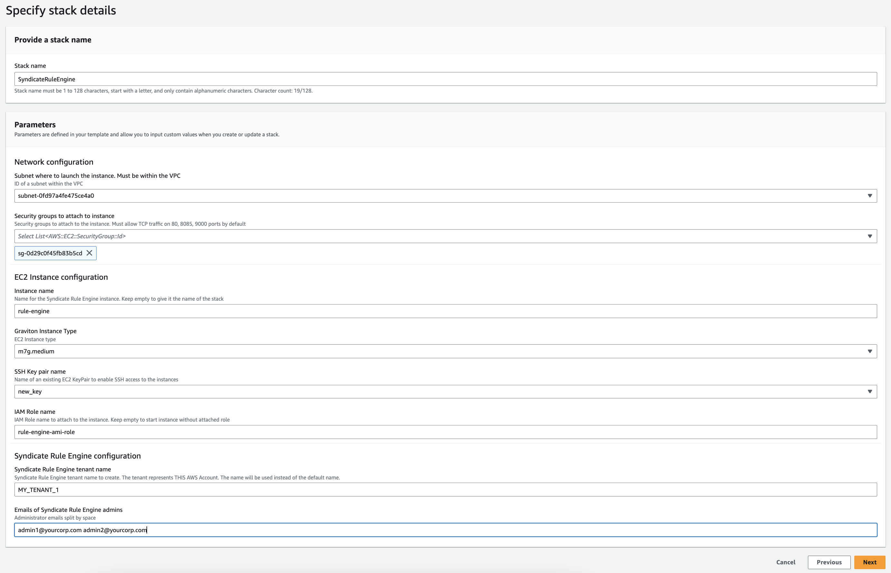
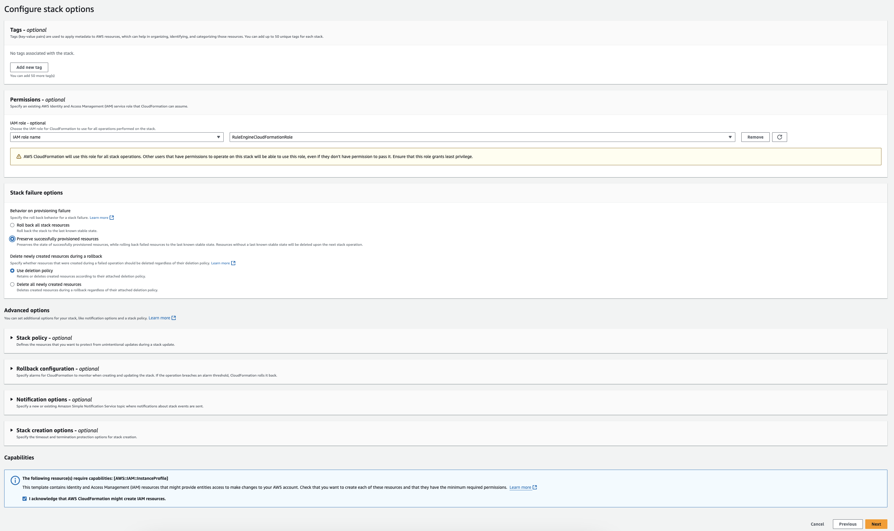
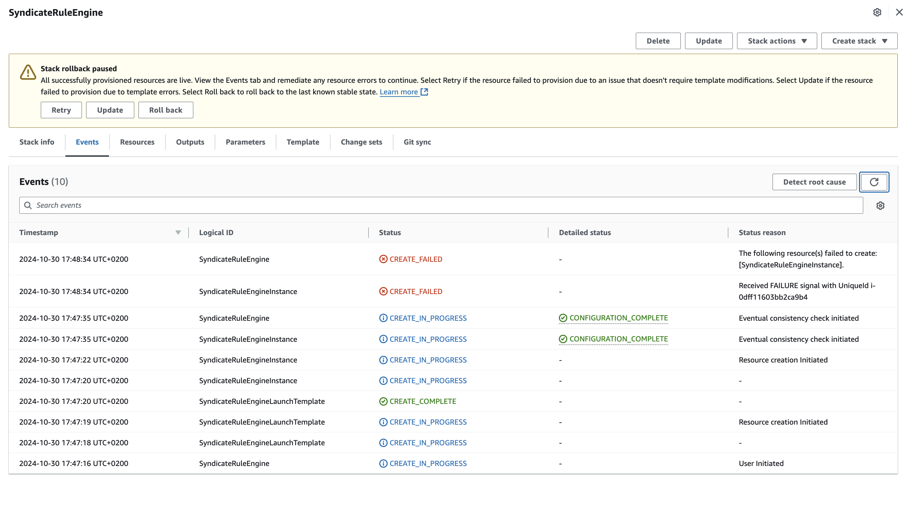

## Syndicate Rule Engine Startup via Cloud Formation

Using AWS Cloud Formation is a recommended way to start Syndicate Rule Engine EC2 Instance. It handles some 
configuration options that are not obvious and provides a convenient way to specify such Syndicate Rule Engine parameters
as tenant name and admin emails.

To set up Syndicate Rule Engine using AWS Cloud Formation follow the section below.


### Purchase Syndicate Rule Engine
Purchase the Syndicate Rule Engine in AWS Marketplace and You will be redirected to AWS Cloud Formation Console 
where You will need to specify stack parameters.

### Specify AWS Cloud Formation stack parameters

You must configure such parameters:
- **AWS VPC id:** choose a VPC where to create a security group for Syndicate Rule Engine. The security group will be attached
  to the EC2 instance and will allow inbound traffic on ports: 80, 8085 and 9000 for Defect Dojo, Modular API 
  and Minio API respectively. Consider that 22 port is closed, so You should open it if You want to have SSH access
- **AWS Subnet id:** choose a subnet within the VPC You've chosen before. EC2 Instance will be created inside that subnet
- **EC2 Instance Type:** choose a type for the instance for the list. It must be at least `m7g.medium`
- **SSH Key pair name:** choose key pair from listed. Will be used to access the instance

Other optional parameters:
- **IAM Role name:** name of AWS IAM role to attach to the instance. The role must be created beforehand and must allow EC2 Service to assume it.
  Keep the field empty if You do not want any role to be attached
- **Syndicate Rule Engine tenant name:** name for the tenant that will be created during startup of Syndicate Rule Engine. The 
  tenant represents the AWS Account where the instance is launched. The name can contain ONLY uppercase letters, digits, dashes and underscores.
  Is the value is not specified, the default one will be used which is `TENANT_1`
- **Syndicate Rule Engine Admin Emails:** list of emails to configure as administrator emails for the customer that will 
  be created during initial setup. Write emails split by a space. Example: `admin1@yourcorp.com admin2@yourcorp.com`.
  Keep the field empty to not configure any emails.

See the example of configuration below:




Click `Next` if all parameters are set.


### Configure stack options

Configure AWS Cloud Formation options provided by AWS:

- **Permissions:** specify IAM Role that will be used by AWS Cloud Formation to deploy the stack. The role must have 
  permissions to manage such AWS resources: EC2 Security Groups, EC2 Launch Templates, EC2 Instance Profiles, EC2 Instances.
- **Stack failure options:** choose `Preserve successfully provisioned resources` options. It will ensure that You will
  still be able to access the instance in case the initial setup fails. If such event happens You will be able to access
  initialization logs and share them with Syndicate Rule Engine support team. If You choose the default value for this option,
  AWS Cloud Formation will terminate the instance immediately when the installation fails
- **Capabilities:** confirm that You `acknowledge that AWS CloudFormation might create IAM resources.`. It's required
  if You specified IAM Role in the previous section. No custom role will be created but the one You have specified will 
  be attached to the instance profile


See the example of configuration below:



Click `Next` if all options are set.


### Create stack

Review all the parameters and options and click `Submit`


### After CLoud Formation stack creation

The stack will create such resources:
- EC2 Security Group
- EC2 Launch Template
- EC2 Instance Profile
- EC2 Instance

The stack will be in `CREATE_IN_PROGRESS` status for as long as it takes the Syndicate Rule Engine instance to initialize.
Usually it takes 8-10 minutes. When the status is `CREATE_COMPLETE` we assume that everything is ok, and You can use the 
Syndicate Rule Engine instance.

If something goes wrong during the initial setup, the instance will send `FAILURE` signal to the Cloud Formation and 
the stack will go into `CREATE_FAILED` status. In such case You should contact the Syndicate Rule Engine support team and provide 
us with initialization log file. It can be found on instance using such path: `/var/log/sre-init.log`. To retrieve 
the log file first You must open 22 port in the security group that is attached to the instance. After that perform the steps:

```bash
scp -i $SSH_KEY_NAME admin@$INSTANCE_PUBLIC_DNS:/var/log/sre-init.log /your/local/directory/
```
After retrieving the file You can delete the Cloud Formation stack.

Here is what it looks like when the installation fails:




We will do our best to help You with the problem.
